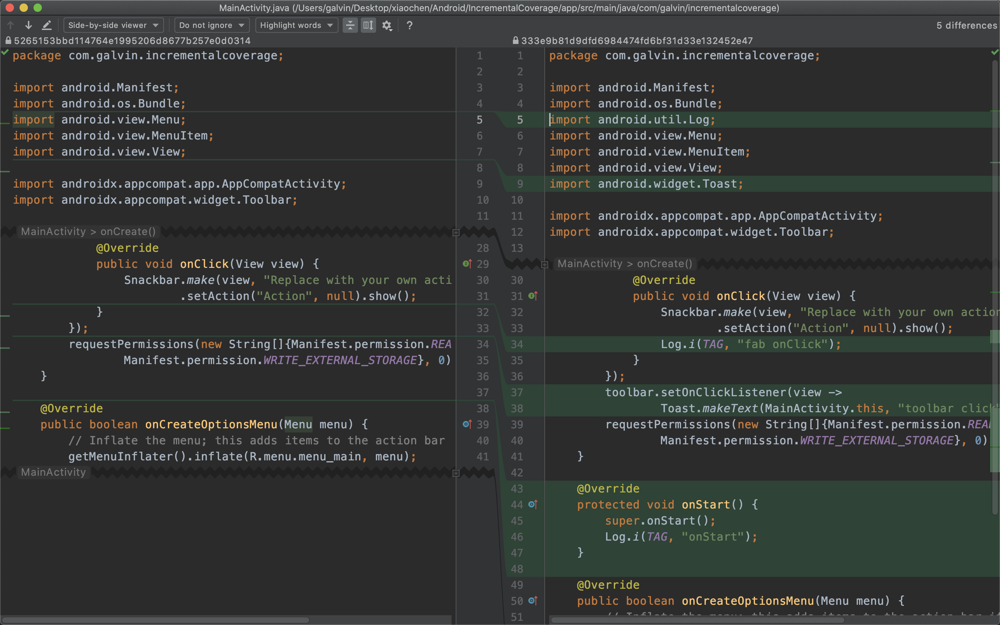
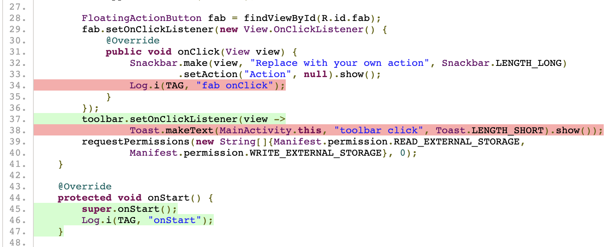

## IncrementalCoverage

IncrementalCoverage is an Android gradle plugin which you can use it to inspect the incremental code coverage.

### How to use

1. Apply the plugin.

```groovy
settings.gradle

pluginManagement {
    repositories {
        gradlePluginPortal()
        google()
        jcenter()
    }
}
```

```groovy
plugins {
    id 'com.android.application'
    id 'io.github.galvin.code-coverage' version '0.0.1'
}
```

2. Define some code to generate the execution file. Such as, you can add the code when activity onDestroy, but you
should guarantee that onDestroy must execute before generating coverage report. Either you can insert a Button, 
use it to generate the execution file. You can see the demo.

```groovy
app: build.gradle

dependencies {
    compileOnly 'org.jacoco:org.jacoco.agent:0.8.4:runtime'
}
```

```java
@Override
protected void onDestroy() {
    super.onDestroy();
    try {
        RT.dumpCoverageData(new File(Environment.getExternalStorageDirectory() + "/coverage.exec"), false);
    } catch (IOException e) {
        e.printStackTrace();
    }
}
```

3. Define your diff in local.properties. We use the command `git diff baseline revision -U0` to get diff source lines.
Actually, you should always keep the revision = "HEAD" because you may change some source files after revision. In 
this situation, the plugin is broken. 

```properties
revision=HEAD
baseline=HEAD~1
```

4. run the app, test your diff code in app.

5. run gradle task `./gradlew generateCoverageReport` to get the coverage report.

### Example



